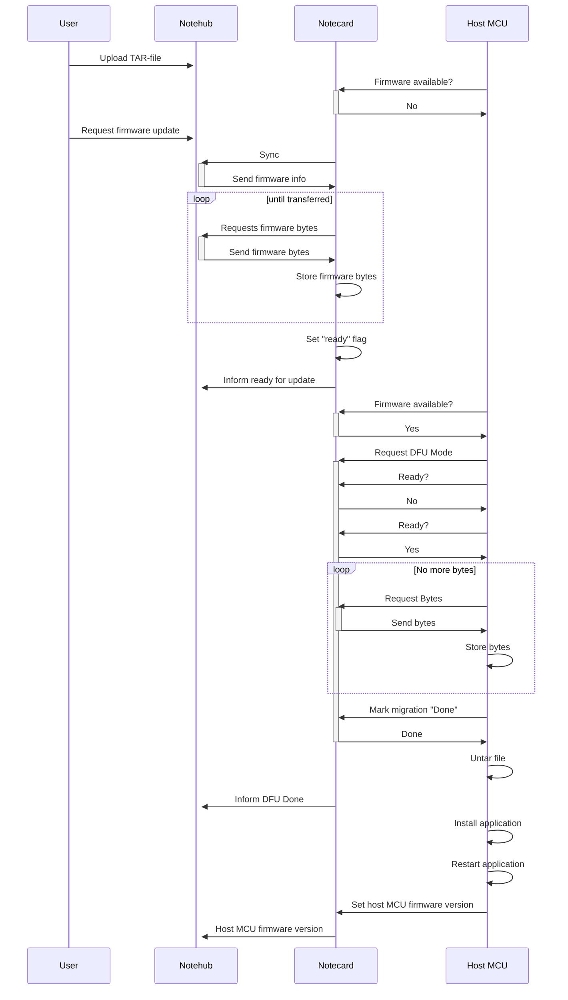

# Python Firmware Update Overview

            

**A couple of things:**
* Notecard disables syncing to the cloud when in DFU mode.  
* Upon exiting DFU mode, Notecard will attempt to reconnect to the cloud using the previous "hub" settings
  

