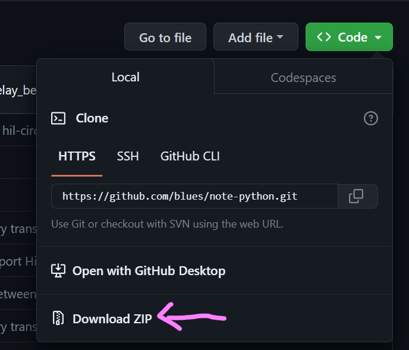

# Python Large File Upload

This sample shows how to use the Notecard to upload a large file using the `card.binary` API and the Notecard Web request API.

For more information on large data transfer with Notecard, visit the following documentation guide
[Sending and Receiving Large Binary Objects](https://dev.blues.io/guides-and-tutorials/notecard-guides/sending-and-receiving-large-binary-objects/)

::: info
For Notecard firmware with versions less than 5.3.1, this example can support the legacy method of encoding the file content in base64
:::

## Hardware Setup

### PC with Standard OS

| | |
|---|---|
|Notecard Interface Options| {USB, UART}|
|Default Notecard Interface| USB[^1]|
|Platform| Linux/Windows|
|Python version| Python3 |

[^1]:Notecard USB appears as serial port on PC.  

### Raspberry Pi with Linux (or similar)

| | |
|---|---|
|Notecard Interface Options| {USB, UART[^2]}|
|Default Notecard Interface| UART*|
|Platform| Linux|
|Python version| Python3 |

[^2]: When using the Notecarrier Pi HAT to connect the Notecard to the Raspberry Pi, be sure [enable the UART](https://www.youtube.com/watch?v=oevxqPk78sM), and select provide the correct UART port name. Usually `/dev/ttyAMA0`

## Notehub Configuration

| | |
|---|---|
|Product UID|Need this to identify the Notehub project|
|Web Proxy Route|Used by the Notecard Web Request API to relay requests to the desired service|

### Creating Web Proxy Route

1. Navigate to <https://notehub.io/projects>
2. Select which project you are going to use
3. Click "Routes" from the navigation menu on the left-hand side of the page
4. Click "Create Route" button on the upper right
5. Select "Web Proxy Route"
6. Set the following

   |Parameter|Value|Description|
   |---------|-----|-----------|
   |Name|My Web Request Route|Name of route you want to appear in Notehub|
   |URL|<https://myjson.live/ping|URL> where HTTP requests from Notecard are forwarded|
   |Alias|ping|Identifier used by Notecard to determine which Web Proxy route to apply|

7. Click "Create Route"

## Using the Application

### Usage Requirements

- Full path to the file you want to upload via Notecard
- Name of the serial port the Notecard is connected to (Default is COM4)

### Basic Usage

#### Windows

``` bash
> python main.py -u MY_PRODUCT_UID -f MY_FILE_PATH -p COM4
```

#### Linux

``` bash
> python main.py -u MY_PRODUCT_UID -f MY_FILE_PATH -p /dev/ttyACM0
```

#### Mac

``` bash
> python main.py -u MY_PRODUCT_UID -f MY_FILE_PATH -p /dev/cu.usbmodemNOTE1
```

::: info
While not required, the `-u` argument is recommended to set the Notecard Product UID. Without the correct Product UID, the Notecard may fail to connect to the network, or may connect to different Notehub project than you expect.
:::

### Command-line Options

| | | |
|---|---|---|
| -u <PRODUCT_UID> | Set Notecard Product UID|
| -p <PORT_NAME> | UART port connected to Notecard. Defaults to COM4|
| -b <BAUD_RATE> | UART serial baud rate. Defaults to 115200|
| -d | Display and log debug messages |
| -e | Measure and display time elapsed during file transfer process |
| --legacy | Use legacy Base64 encoding method |

### Additional Options

``` bash
> python main.py -h
```

## Application Installation

1. Clone this repository
2. Run `pip install -r requirements.txt` to install all of the prerequisites.

## Upload Method Summary

1. Host asks Notecard to clear it's binary data storage area
2. Host asks Notecard how much space is available to store binary data
3. Host tells Notecard it is going to receive a binary blob
4. Host tells Notecard to flush the current binary blob to Notehub
5. Host repeats steps 1-4 until all of the binary data has been uploaded to Notehub
6. Binary blob is forwarded via HTTP request from Notehub to location configured by the Notehub web proxy route

Step 1 ensures there's not lingering data to pollute the upload, and maximizes the available storage space.

Step 2 ensures that the Host doesn't attempt to push more data to the Notecard than it can store.

## Compare Legacy Method

In Notecard developer firmware release 5.3.1, the `card.binary` feature was added to make it easier and faster to upload and download larger blobs of binary data.

Prior to this feature addition, the upload method follows this general process

1. Host encodes chunk of binary data as base64 string
2. Host tells Notecard to flush the current base64 data to Notehub
3. Host repeats steps 1 and 2 until all of the binary data has been uploaded to Notehub
4. Binary blob is forwarded via HTTP request from Notehub to location configured by the Notehub web proxy route

While it appears to be fewer steps, the number of iterations to complete the entire upload transaction is much higher, as the number of bytes transferred on each transaction is relatively small.  

For large binary blobs, the difference in upload time is substantial.


## Updating the note-python SDK

As of version v1.4.4 of the _note-python SDK_, the `card.binary` convenience functions are not available in the SDK.  Therefore, using `pip install note-python` may result in an SDK version that is incompatible with this example.

The _note-python_ core module is included in the `notecard` folder in this repository until a new version is released.  In the mean time, if you need to update the _note-python SDK_ for any reason, you will need to do the following:

1. Download the ZIP-file from the [note-python](https://github.com/blues/note-python) repository on Github

    

2. Extract the ZIP-file
3. Move the `notecard` folder from the ZIP-file to the folder containing this README.md file

The folder structure should appear as

``` text
> .
  > .venv (folder for Virtual Environments in Python)
  > notecard
  .gitignore
  main.py
  notecardDataTransfer.py
  README.md
  requirements.txt
```

