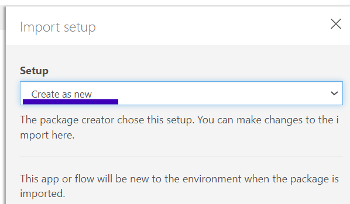
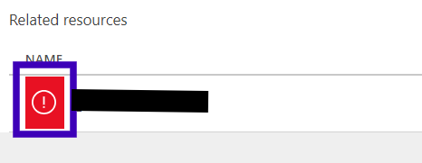

# Upload Files to OneDrive via Power Automate

Upload files to Notehub in chunks, and then transfer the entire file to OneDrive using Power Automate as the transfer and OneDrive Authentication medium.

Notecard and Notehub have a mechanism to upload larger binary data blobs by enabling the host MCU to provide chunks of the binary blob to Notecard, and once the chunks arrive on Notehub, they will be reassembled.  Once the last chunk arrives, the blob will be reassembled, and the entire blob will be routed to the selected end point, in this case Power Automate webhook, which will then pass it to OneDrive.

## Power Automate Flow Configuration

The Power Automate Flow consists to 3 components

- HTTP request trigger
- OneDrive Create File action
- HTTP response action

The HTTP response action is not _required_, but does provide a way to indicate if the file upload process was successful.

### Import Flow Package

Using this workflow, you can import the template example found here:

1. Be sure [templates/loadFileToOneDrive.zip](templates/loadFileToOneDrive.zip) is downloaded to your machine
2. Navigate to <https://make.powerautomate.com/> and select _My Flows_
3. From the _Import_ dropdown, select _Import Package (legacy)_
4. Click _Upload_ button, and select the ZIP-file downloaded in step 1
5. Select the ❗on the  _Flow Import Setup_ row if it has ❗
   a. Ensure Import Setup is set to _Create as new_
   
   b. Click _Save_
6. Select the ❗under _Related Resources section
   

   a. Change the resource to 1 available from your selection list
   b. Click _Save_
7. Click _Import_
8. Once import process completes, navigate to _My Flows_ again

For more information on import/export of Power Automate Flows, see: https://learn.microsoft.com/en-us/power-automate/export-import-flow-non-solution#import-a-flow

### Configure Flow Package

9. Click on the hyperlink to view the newly imported Flow details
10. Click the _Turn On_ button
11. Click the _Edit_ button
12. Select the block labeled _manual_
13. Click the _Copy URL_ button next to the HTTP POST URL
14. Paste this URL somewhere safe.  You'll need it for the Notehub configuration
15. Select the _Create File_ block
16. At this point, you may need to connect to your OneDrive account.  Follow the authorization steps.

    Depending on your account configuration, you may need approval from your OneDrive administrator to enable the connection.

17. Change the value of the _Folder Path_ field to a location that you prefer
18. Click the _Save_ button

### Testing the Flow

Test the flow by sending a test file from your computer to ensure the flow is working.

```shell
curl "<URL from step 13>&file=myTestFile.txt" -d "path/to/myTestFile.txt"
```

> **Important** include the `&file=myFileName.extension` at the end of the URL. The `file` query parameter is used to set the file name in OneDrive.

This should result in a JSON response that looks like

```json
{
    "onedrive_id": "b!eDHT6IDW2Uy6gtPMONVA75mcZ7P0_5VJt_sGGRjzEh8GJ7x6btQ0R5awrjZCwPIX.01RMFDK7AVM2NJGJELNZG3PAZL5RVN75FA",
    "filename": "myTestFile.txt"
}
```

which contains the item id and the name of the generated file on OneDrive.

Navigating to the OneDrive folder where you selected which folder to create files in step 17, and notice a file created called "myTestFile.txt"

## Notehub Configuration

| | |
|---|---|
|Product UID|Need this to identify the Notehub project|
|Web Proxy Route|Used by the Notecard Web Request API to relay requests to the desired service|

### Creating Web Proxy Route

1. Navigate to <https://notehub.io/projects>
2. Select which project you are going to use
3. Click "Routes" from the navigation menu on the left-hand side of the page
4. Click "Create Route" button on the upper right
5. Select "Web Proxy Route"
6. Set the following

   |Parameter|Value|Description|
   |---------|-----|-----------|
   |Name|OneDrive File Upload|Name of route you want to appear in Notehub|
   |URL|`<URL from step 13>?file=` |URL of the Power Automate web request trigger appended with `?file=`|
   |Alias|onedrive|Identifier used by Notecard to determine which Web Proxy route to apply|

7. Click "Create Route"

The URL is appended with the `file` query parameter so the Notecard can provide the file name during the upload process.
The value of the `web.post` request `name` field gets appended to the proxy route URL.

## Using the Application

### Usage Requirements

- Full path to the file you want to upload via Notecard
- Name of the serial port the Notecard is connected to (Default is COM4)

### Basic Usage

#### Windows

``` bash
> python main.py -u MY_PRODUCT_UID -f MY_FILE_PATH -p COM4 -r onedrive -i
```

## Edge Device Application Changes

Use the `setFileName` method of the _BinaryDataUploader_ class to provide the name of the file to be stored in OneDrive.
By default, the `upload` method will unset the name.

The assumption is that most applications will change the file name on each upload.  To avoid this,
use `obj.upload(data, unsetFileName=False)`.  You can use the `unsetFileName` method to unset the file name manually.

## Common Issues

### Power Automate Webhook 401 Status Code

If you see a HTTP status code of 401 either returned to the Notecard, or logged in the Notehub routing log, the likely culprit is the permissions level of the inbound webhook configured in Power Automate.

On a few occasions, we noticed the permissions level seemed to change when editing the Power Automate flow, even without explicitly editing the webhook configuration.

In Power Automate

1. Click the Edit flow button
2. Select the "inbound webhook" block
3. In the configuration pane, ensure "Who can trigger the flow" is set to "Anyone"

## Motivation to use Power Automate

Notehub does not have a way to make proxy web requests that involve OAuth style authentications without performing all of the authentication requests from the Notecard.

This isn't ideal because it means the edge device communicating with Notehub must be provided access keys, URLs, etc. As well as finding a way to provide the generated authentication key to the specific edge device. This complicates the interaction.

Instead, we can leverage the built-in authentication capabilities for OneDrive provided by Power Automate, and create an HTTP request endpoint that will accept the file and then upload it to the appropriate OneDrive location.

### Limitations to Power Automate

There are a couple of limitations to using Power Automate.  

- Requires an upgraded plan to support inbound web requests to trigger Flows in Power Automate.
- Inbound requests must be less than 150MB in size

### Alternatives to Power Automate

A couple of alternatives to Power Automate have been investigated.  Their limitations are listed here:

|Service|Limitation|
|---|---|
|Zapier|Inbound web request trigger is limited to 2MB|
|Pipedream|Inbound web request trigger limited to < 2MB|
|OneDrive API|Requires stateful system to store authorization tokens, and upload stream ids|

While each of these _could_ work, it requires managing file upload to be limited in sized, as well as managing the file upload process in the Zapier Zap, Pipedream Workflow or edge device application.  This complicates the process, so were abandoned in favor of a simpler workflow.
